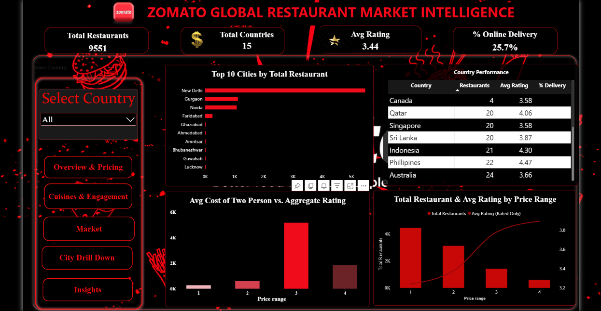
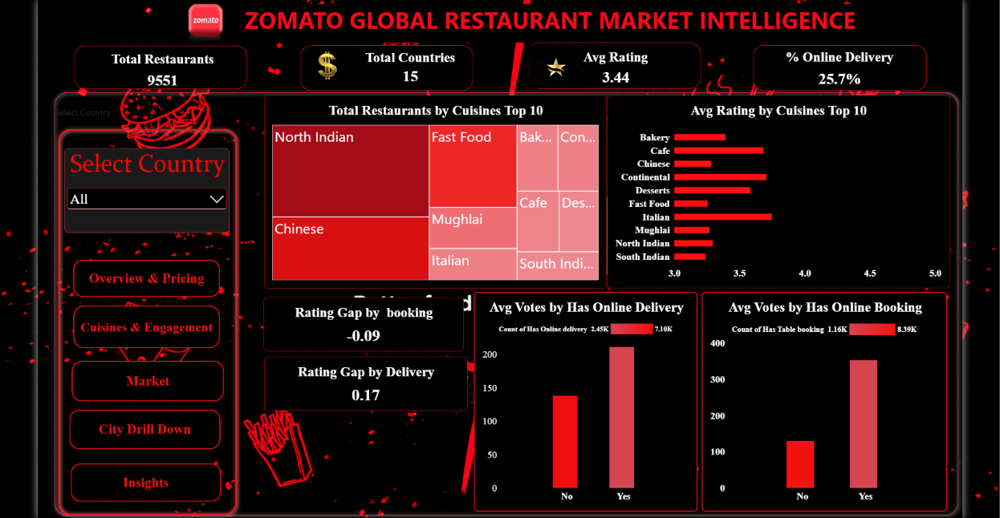
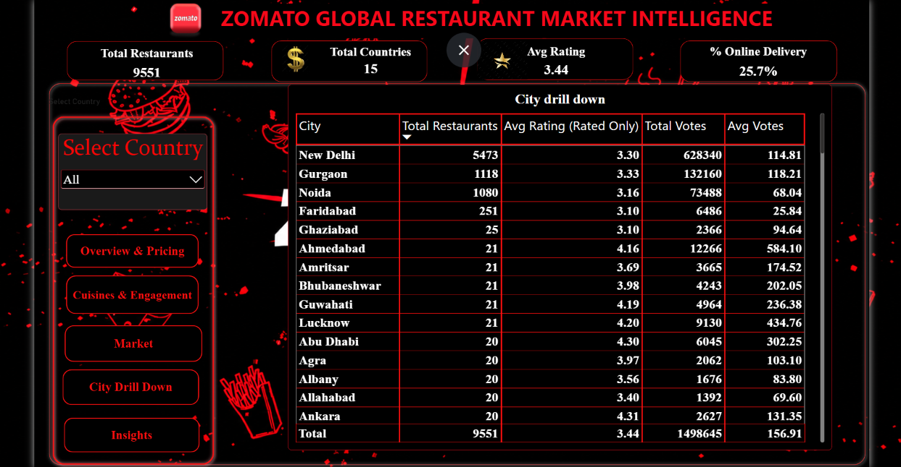
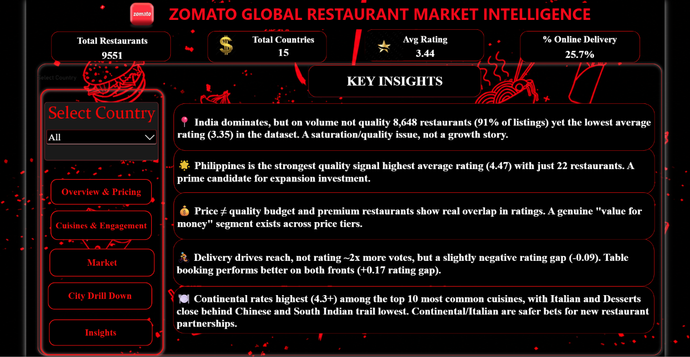
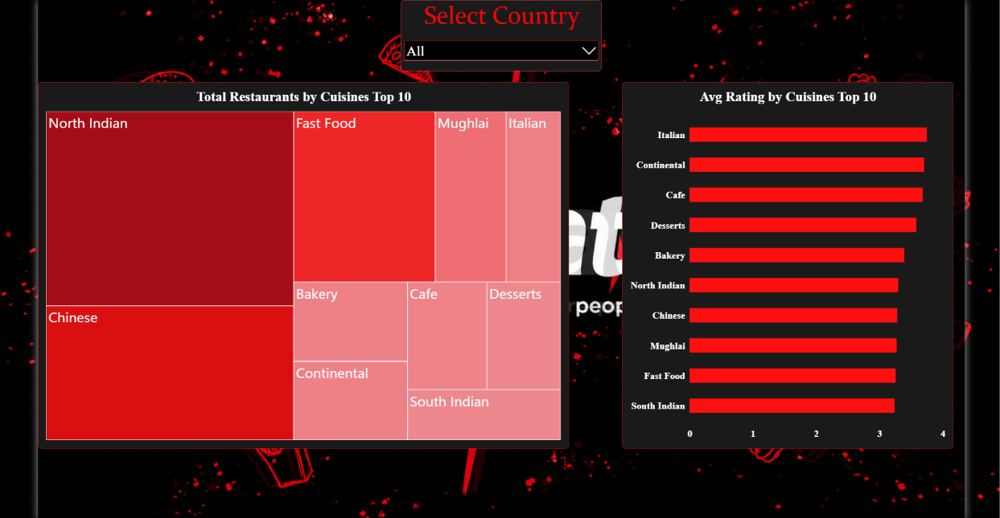
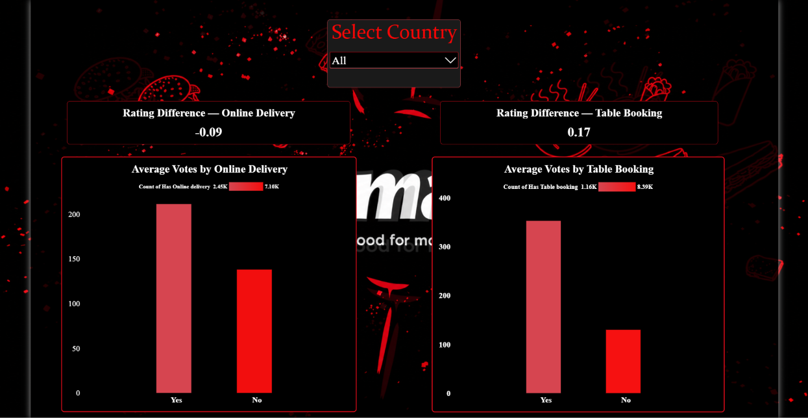
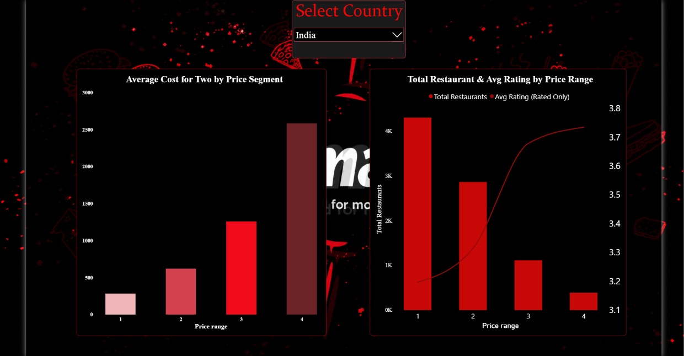
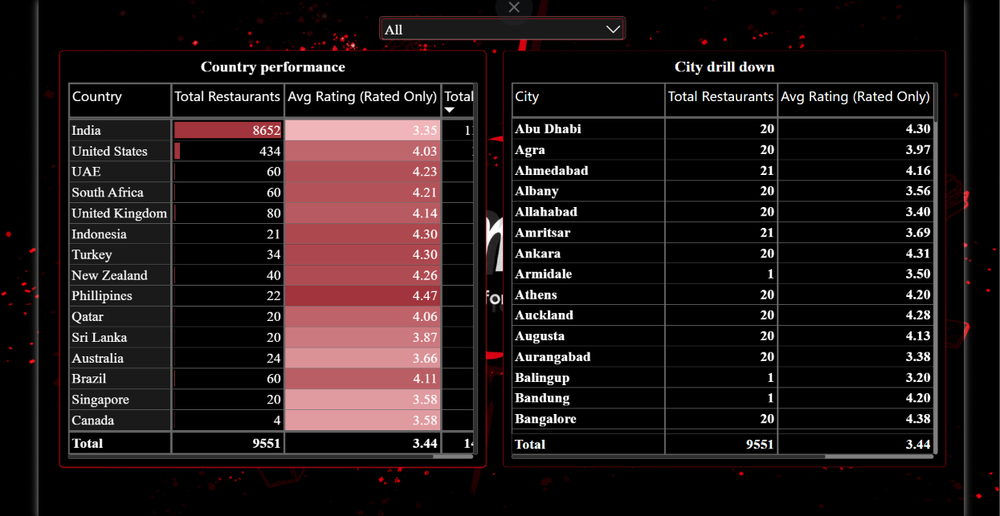

# Zomato-Business-Intelligence-Dashboard
Power BI Business Intelligence dashboard analyzing Zomato restaurant performance, market trends, pricing, cuisines, ratings, and customer engagement across 15 countries and 9,551 restaurants.

Portfolio project: Power BI · DAX · Power Query · Data Modeling · Business Intelligence · Microsoft Excel

The dashboard combines Power Query, data modeling, DAX, interactive filtering, market analysis, pricing analysis, service-feature analysis, cuisine analysis, and city-level drill-downs to turn restaurant-level data into decision-oriented business insights.

## 📊 Dashboard Overview

### 1. Executive Overview

The Executive Overview provides the high-level picture of the Zomato restaurant dataset.

### 2. Cuisines & Engagement

This page combines cuisine performance with customer engagement and service-feature analysis.

### 3. Market Overview

The Market page provides a geographic view of restaurant-market presence.

### 4. City Drill Down

The City Drill Down page provides a detailed view of restaurant performance at the city level.

### 5. Key Insights

The Insights page converts the dashboard analysis into business-oriented observations.

### 6. Cuisine Analysis

The Cuisine page focuses on the Top 10 cuisines by restaurant presence and compares their average ratings.

### 7. Service Features & Engagement

This page evaluates whether restaurants offering online delivery or table booking show different observed ratings and customer engagement.

### 8. Pricing & Value

The Pricing page analyzes restaurant distribution across the four price-range segments and compares average cost for two people.

### 9. Market Analysis

The Market page compares countries using restaurant volume and customer ratings, while also providing a city-level view.

)

## 🧮 Data Preparation

The dataset was prepared using Power Query before visualization.

Key transformations

Corrected CSV encoding/parsing

Promoted headers

Applied appropriate data types

Removed duplicate restaurants using Restaurant ID

Removed blank rows

Handled missing/error values

Cleaned text fields

Trimmed cuisine names

Split multi-value cuisine fields into separate rows

Created a country-code lookup table

The original restaurant table remains separate from the cuisine-split table.

## 🗂️ Data Model

The model uses a country lookup table, the main restaurant table, and a cuisine-split table.

Relationships

Sheet1[Country Code] → zomato[Country Code]

zomato[Restaurant ID] → zomato split by cuisines[Restaurant ID]

The direct Country Lookup → Cuisine Split relationship is inactive to avoid creating an ambiguous filtering path.

## 🛠️ Tools & Technologies

Technology

Purpose

Power BI

Dashboard development and interactive reporting

DAX

KPIs, rating calculations, engagement measures

Power Query

Data cleaning and transformation

Excel

Country-code lookup

CSV

Restaurant-level source data

Data Modeling

Relationships between restaurant, country, and cuisine data

Data Visualization

Tables, charts, treemaps, KPI cards, and maps

## 🎯 Business Questions Answered

The dashboard was designed around the following questions:

Which countries and cities have the strongest restaurant presence?

Which markets show stronger or weaker observed rating performance?

Does higher price positioning correspond to higher ratings?

How are online delivery and table booking associated with ratings?

How do service features relate to customer engagement?

Which cuisines combine meaningful restaurant presence with strong ratings?

Which cities represent the largest concentrations of restaurants?

## 🚀 Project Workflow

Raw Zomato Data
       ↓
Power Query Cleaning
       ↓
Data Transformation
       ↓
Country Lookup + Cuisine Split
       ↓
Data Model
       ↓
DAX Measures
       ↓
Interactive Power BI Dashboard
       ↓
Business Analysis
       ↓
Decision-Oriented Insights

## 📌 Project Scope

Data cleaning and transformation

Data modeling

Country lookup integration

Cuisine normalization

DAX measures

Interactive country filtering

Market analysis

Pricing analysis

Service-feature analysis

Cuisine analysis

City-level analysis

Business insights

Bookmark-based dashboard navigation

## 📜 License

This project is distributed under the MIT License.

See LICENSE for the full license text.

